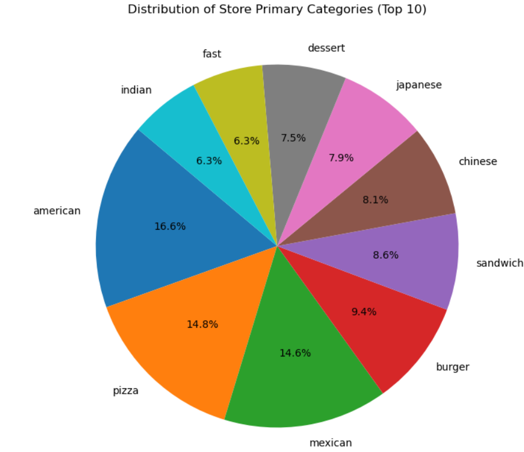
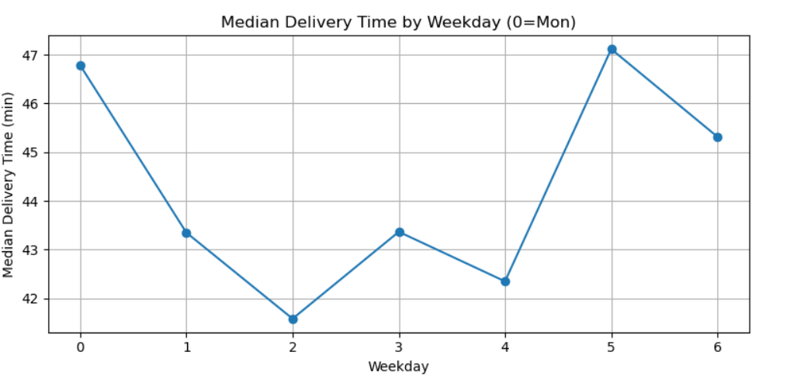
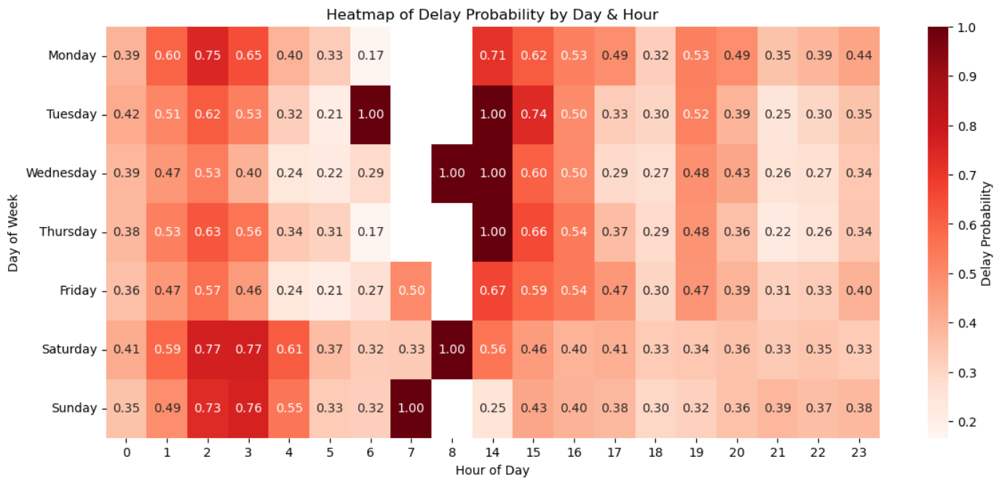
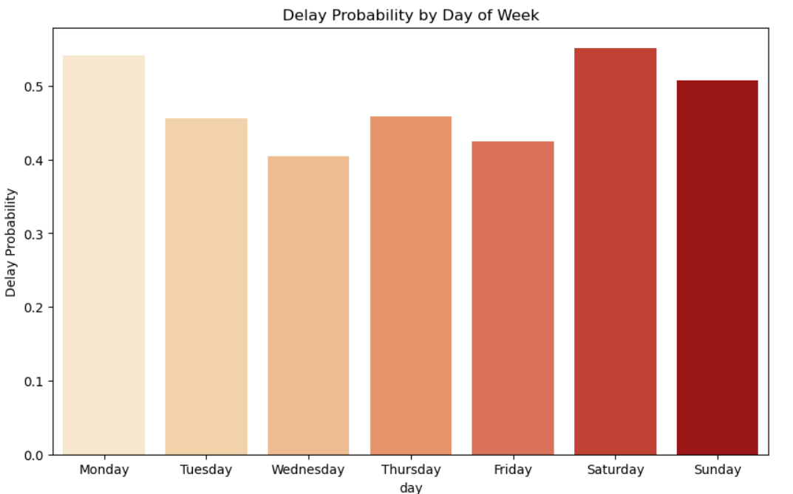

# Delivery Analytics Project 🚚📊

## 📌 Overview
This project analyzes delivery performance data to identify bottlenecks, SLA risks, and operational improvement areas.  
The analysis covers **delivery times, workload patterns, store categories, order protocols, and customer basket sizes**.  
Final outcomes include **actionable insights and recommendations** for improving on-time delivery and reducing peak-hour delays.  

---

## 🗂 Dataset
- Delivery transactions with timestamps, partner status, order category, basket size, and delivery duration.
- Target KPI: **On-time Delivery Rate (SLA compliance)**.

---

## 🔍 Analysis Performed
- **Univariate analysis**: Distribution of delivery duration, outlier detection, SLA compliance rate.
- **Bivariate analysis**: Correlation of workload (busy/onshift), basket size, category, and protocol with delays.
- **Multivariate insights**: Timing + workload interactions, delay probability by weekday/hour.
- **Final KPIs**: Median delivery duration, SLA breach rate, category performance.

---

## 📊 Key Results
- **Median Delivery Duration**: ~44 mins, with long tail beyond 70 mins.  
- **On-time Delivery Rate**: ~52%.  
- **Peak congestion**: Lunch (12–14) and dinner (19–22) slots show max SLA breach probability.  
- **Workload effect**: Busy/onshift ratio >0.9 sharply increases delays.  
- **Large baskets** (>10 items) add ~8–10 minutes on average.  

---

## 📷 Visualizations
Below are some key charts from the analysis (saved under `/images`):

### 1. Primary Category Distribution

### 2. Median Delivery Time by Weekday

### 3. Delay Probability by Day and Hour 

### 4. Delay Probability by Day of Week

---

## 🚀 Recommendations
- Pre-position partners and dynamic batching during peak hours.  
- Add surge on-shift capacity when busy/onshift >0.9.  
- Audit slow categories and protocols.  
- Introduce prep-time aware dispatch for large baskets.  

---

## 📈 Business Impact
Implementation of recommendations is expected to:  
- Increase **on-time delivery rate by 10–15%**.  
- Reduce **peak-hour complaints**.  
- Lower **partner overload** and improve retention.  
- Enhance **operational efficiency** across categories.  

---

## 🛠 Tech Stack
- **Python**: pandas, numpy  
- **Visualization**: matplotlib, seaborn  
- **Notebook**: Jupyter  

---

## 📬 Contact
For queries or collaborations: **ashishraj3601@gmail.com**  
